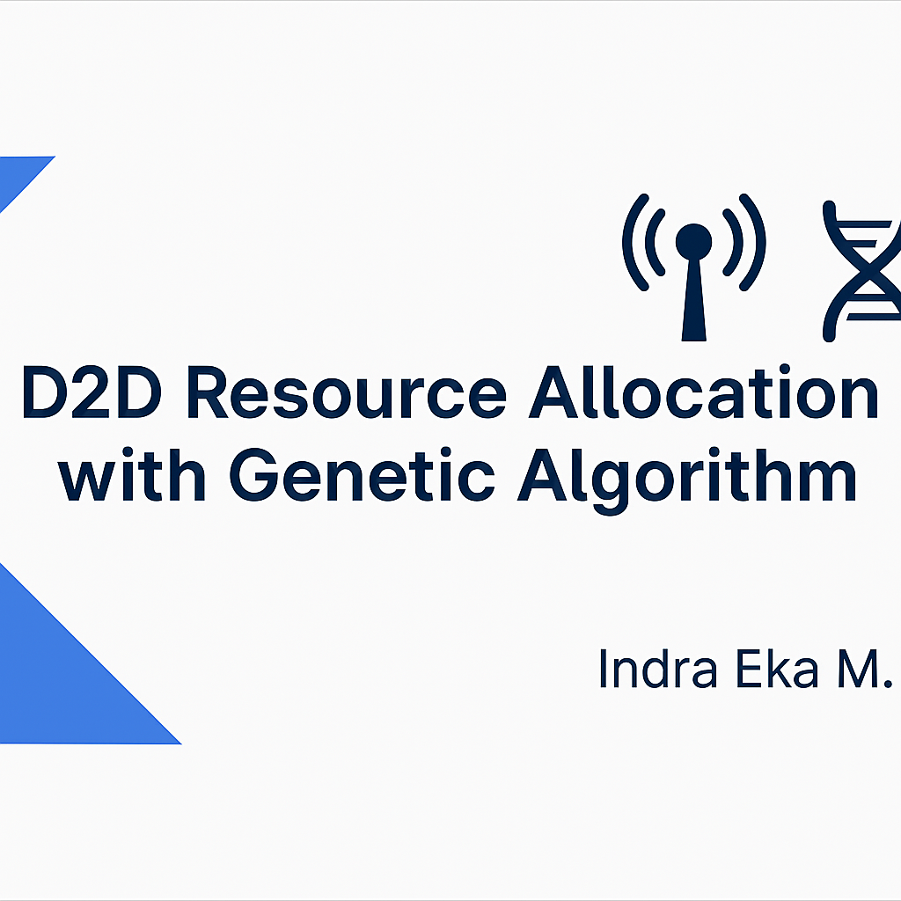

# 📡 D2D Resource Allocation using Genetic Algorithm (MATLAB)



This project implements an **optimization system for relay and resource allocation** in Device-to-Device (D2D) communication using a **Resource Grouping Scheme**.  
The core algorithm used is the **Genetic Algorithm (GA)**, developed and simulated in **MATLAB R2020**.

---


---

## 🎯 Objective

- Optimize resource and relay allocation in a D2D communication environment
- Apply a Resource Grouping scheme to reduce interference
- Maximize throughput while maintaining user fairness
- Simulated in MATLAB R2020 using Genetic Algorithm

---

## 📈 Features

- MATLAB-based simulation environment
- Chromosome encoding of relay and resource selection
- Fitness function based on signal-to-interference and throughput
- Visualization of convergence & allocation results

---

## 📂 Project Structure

```
D2D_Resource_Allocation_GA/
├── algen.m
├── crossover.m
├── elitism.m
├── hitung_fitness.m
├── inisialisasi.m
├── mutasi.m
└── README.md
```

---

## 🚀 How to Run

1. Open the project folder in **MATLAB R2020** or higher
2. Run `algen.m`
3. Adjust parameters: number of users, relays, resources
4. View optimization convergence and final allocation map

---

## 👨‍💻 Author

**Indra Eka Mandriana S.Kom**  
_Optimization & Wireless Systems Researcher_

---

## ⭐ Give it a ⭐ if you found this useful!
